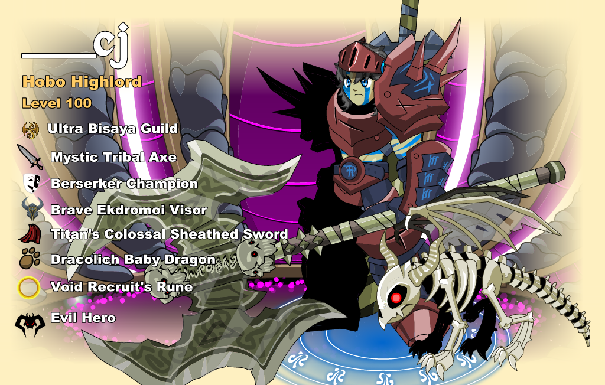

# Render presentation modes

Implemented 2026-09-07. Deployment and ARM builds remain owner-run.

## Discord

`/render-charpage` is test-guild-only. It uses the existing render admission,
per-user limits, result delivery, upload-size handling, and AVIF/WebP metadata.
`/render` keeps its existing controls and transparent, fitted character view.

Examples:

```text
/render-charpage username:___cj output_format:avif output_size:2048 max_frames:120
/render-charpage username:___cj info:false
/render-charpage username:___cj background:false info:false
/render-charpage username:___cj view:character background:true info:false facing:right
/render-charpage username:___cj character_x:400 character_y:304.2 canvas_width:650
```

The command exposes a master `use_cache` toggle; `output_format`, `lossless`,
`quality`, `webp_method`, and `avif_speed`; frame count and animation controls;
and `output_size` / `raster_size`. `quality` applies to the selected format.
`lossless:true` works for both formats. AVIF retains zstd-compressed lossless
RGBA intermediates. Default facing is left to match the supplied charpage
screenshot; `facing:right` flips the character without flipping text/background.

`background` and `info` independently override the selected preset.
`framing`, `canvas_width`, `canvas_height`, `character_x`, and `character_y`
control layout. Canvas dimensions/positions use logical layout coordinates,
independent of the output pixel resolution. The original stage is 550×350,
with the character registered at (338.05, 304.2). `output_size:2048` therefore
produces approximately 2048×1303 pixels, with exact height following the
existing two-stage raster/output rounding.

In content framing, the viewport follows the character's full animation bounds.
Moving the character also moves that fitted viewport, so registration changes
have no visible effect. Use fixed framing to position the character within a
stationary canvas. Fixed framing intentionally clips oversized equipment at
its edges, like the original charpage. It does not automatically shrink the
whole character to accommodate large weapons/pets.

## Shared layout contract

`render.view` selects a preset, while optional `render.presentation` overrides
individual layout properties. These controls are independent of output codecs,
character rasterization, and the Discord command name.

| Property | Character preset | Charpage preset |
|---|---|---|
| `framing` | `content` | `fixed` |
| `viewport` | unused while fitting | `[0,0,550,350]` |
| `character_position` | `[0,0]` | `[338.05,304.2]` |
| `background` | false | true |
| `info` | false | true |

Example request fragment for the existing fitted view with a background:

```json
{"render":{"view":"character","presentation":{"background":true,"info":false}}}
```

Fixed framing with a custom viewport and no text:

```json
{"render":{"view":"charpage","presentation":{"viewport":[0,0,650,350],"character_position":[400,304.2],"info":false}}}
```

These fragments also work with `/retry-render`'s `overrides` JSON. Retries inherit
saved presentation settings. If changing a saved, fully expanded preset, set
`"presentation":null` alongside the new `view` to reset its overrides.

CLI equivalents:

```sh
scripts/render-character ___cj --view charpage --format avif
scripts/render-character ___cj --view character --background --no-info
scripts/render-character ___cj --view charpage --no-info --viewport 0 0 650 350 --character-position 400 304.2
```

## Implementation and reuse

`presentation.rs` resolves/validates presets, calculates the viewport, and matches
the existing composer's canvas rounding. Character placement is implemented by
shifting the viewport relative to its registration point; component transforms,
color correction, raster backend, and animation selection stay shared.

`charpage.rs` supplies the original AQW background and information artwork.
Backgrounds cover the selected viewport without changing their aspect ratio;
the original fade follows the viewport edges. The information overlay fits
inside the viewport, anchored at its top-left. It uses the original embedded
fonts and equipment/guild/faction icons, with XML escaping and shrinking for long
text. Equipment labels reflect the same base/cosmetic and visibility selections
as the character metadata. Profile Pic and Cosmetics controls are excluded.

The static layers are rasterized once per job, stored as PNG, and referenced as
optional `presentation_layers.background` / `.foreground` in the prepare
manifest. The compositor has no charpage-specific logic: it downloads/decodes
each optional layer once per batch, copies the background, composites character
layers, then composites the foreground. Both existing output paths consume
that final canvas. No GPU, browser session, additional workflow node, or runtime
background download is needed.

The asset bundle contains the default background plus all 35 official selectable
backgrounds (selected by base-36 `bgindex`). Background artwork uses the first
frame; character/equipment animation remains supported. Source checksums and a
rebuild script are included under `assets/charpage` and
`scripts/build_charpage_assets.py`. Layout and artwork policy versions plus
presentation settings/background/faction participate in the final cache key.
Legacy Python rendering stages reject custom presentation rather than silently
producing the wrong view; production uses the Rust pipeline.

## Validation and rollout

Local tests cover independent layout controls, invalid coordinates/types,
odd-size canvas rounding, static-layer ordering for both WebP and zstd AVIF,
prepared manifest/artifact consistency, guild restrictions, queue settings,
and retries. A local one-frame render of ___cj uses the actual official SWFs,
the prepare/bounds/component raster path, and the shared compositor.

Local preview tools (no AWS):

```sh
cargo run --manifest-path services/pipeline-rust/Cargo.toml --example charpage_preview -- FIELDS.json /tmp/card-art 1024
cargo run --manifest-path services/pipeline-rust/Cargo.toml --example charpage_render_local -- FIELDS.json characterB.swf ffdec.jar /tmp/card-render --allow-official-downloads --facing-left
```

Update the pipeline and component-compose images together, then restart the bot
to register `/render-charpage`. No new infrastructure resources or IAM grants
are required. Local macOS results validate functionality and appearance, not
Graviton latency or encoded AWS animation sizes; those remain owner-run checks.

Local still-frame preview of `___cj` (1024-pixel output, original assets;
animated items are sampled at their first frame):


